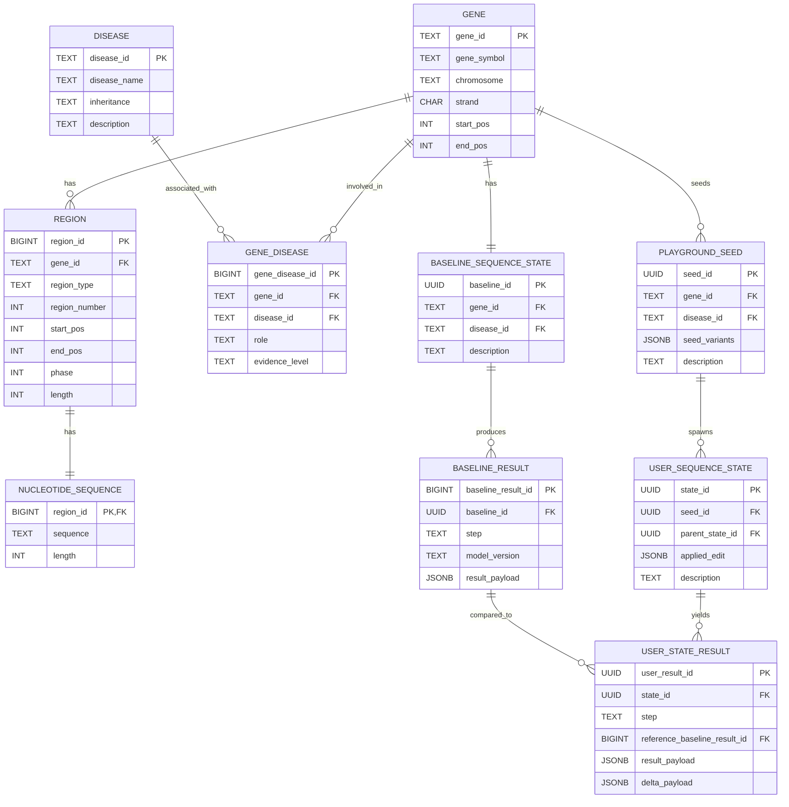

```mermaid
erDiagram
    GENE {
        TEXT gene_id PK
        TEXT gene_symbol
        TEXT chromosome
        CHAR strand
        INT start_pos
        INT end_pos
    }

    REGION {
        BIGINT region_id PK
        TEXT gene_id FK
        TEXT region_type
        INT region_number
        INT start_pos
        INT end_pos
        INT phase
        INT length
    }

    NUCLEOTIDE_SEQUENCE {
        BIGINT region_id PK, FK
        TEXT sequence
        INT length
    }

    DISEASE {
        TEXT disease_id PK
        TEXT disease_name
        TEXT inheritance
        TEXT description
    }

    GENE_DISEASE {
        BIGINT gene_disease_id PK
        TEXT gene_id FK
        TEXT disease_id FK
        TEXT role
        TEXT evidence_level
    }

    BASELINE_SEQUENCE_STATE {
        UUID baseline_id PK
        TEXT gene_id FK
        TEXT disease_id FK
        TEXT description
    }

    BASELINE_RESULT {
        BIGINT baseline_result_id PK
        UUID baseline_id FK
        TEXT step
        TEXT model_version
        JSONB result_payload
    }

    PLAYGROUND_SEED {
        UUID seed_id PK
        TEXT gene_id FK
        TEXT disease_id FK
        JSONB seed_variants
        TEXT description
    }

    USER_SEQUENCE_STATE {
        UUID state_id PK
        UUID seed_id FK
        UUID parent_state_id FK
        JSONB applied_edit
        TEXT description
    }

    USER_STATE_RESULT {
        UUID user_result_id PK
        UUID state_id FK
        TEXT step
        BIGINT reference_baseline_result_id FK
        JSONB result_payload
        JSONB delta_payload
    }

    GENE ||--o{ REGION : has
    REGION ||--|| NUCLEOTIDE_SEQUENCE : has

    GENE ||--o{ GENE_DISEASE : involved_in
    DISEASE ||--o{ GENE_DISEASE : associated_with

    GENE ||--|| BASELINE_SEQUENCE_STATE : has
    BASELINE_SEQUENCE_STATE ||--o{ BASELINE_RESULT : produces

    GENE ||--o{ PLAYGROUND_SEED : seeds
    PLAYGROUND_SEED ||--o{ USER_SEQUENCE_STATE : spawns
    USER_SEQUENCE_STATE ||--o{ USER_STATE_RESULT : yields

    BASELINE_RESULT ||--o{ USER_STATE_RESULT : compared_to
```