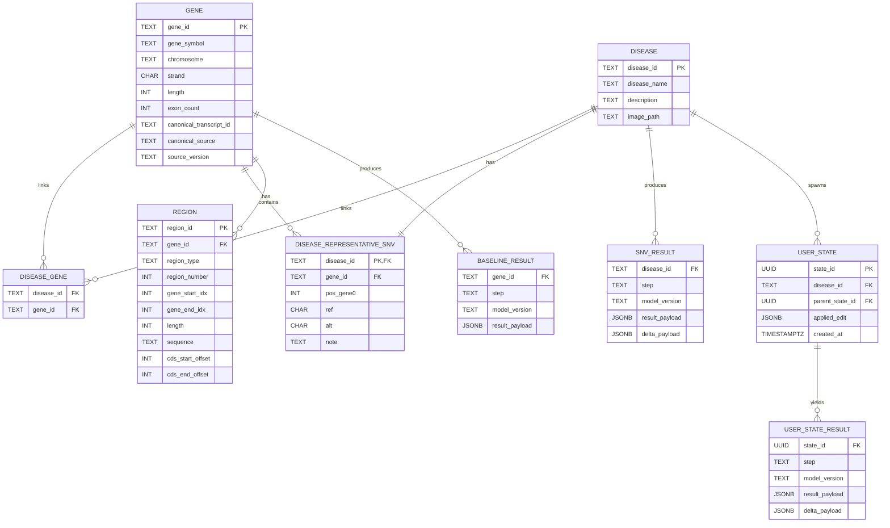

```mermaid
erDiagram
    DISEASE {
        TEXT disease_id PK
        TEXT disease_name
        TEXT description
        TEXT image_path
    }

    GENE {
        TEXT gene_id PK
        TEXT gene_symbol
        TEXT chromosome
        CHAR strand
        INT length
        INT exon_count
        TEXT canonical_transcript_id
        TEXT canonical_source
        TEXT source_version
    }

    DISEASE_GENE {
        TEXT disease_id FK
        TEXT gene_id FK
    }

    DISEASE_REPRESENTATIVE_SNV {
        TEXT disease_id PK, FK
        TEXT gene_id FK
        INT pos_gene0
        CHAR ref
        CHAR alt
        TEXT note
    }

    REGION {
        TEXT region_id PK
        TEXT gene_id FK
        TEXT region_type
        INT region_number
        INT gene_start_idx
        INT gene_end_idx
        INT length
        TEXT sequence
        INT cds_start_offset
        INT cds_end_offset
    }

    BASELINE_RESULT {
        TEXT gene_id FK
        TEXT step
        TEXT model_version
        JSONB result_payload
    }

    SNV_RESULT {
        TEXT disease_id FK
        TEXT step
        TEXT model_version
        JSONB result_payload
        JSONB delta_payload
    }

    USER_STATE {
        UUID state_id PK
        TEXT disease_id FK
        UUID parent_state_id FK
        JSONB applied_edit
        TIMESTAMPTZ created_at
    }

    USER_STATE_RESULT {
        UUID state_id FK
        TEXT step
        TEXT model_version
        JSONB result_payload
        JSONB delta_payload
    }

    DISEASE ||--o{ DISEASE_GENE : links
    GENE ||--o{ DISEASE_GENE : links

    DISEASE ||--|| DISEASE_REPRESENTATIVE_SNV : has
    GENE ||--o{ DISEASE_REPRESENTATIVE_SNV : contains

    GENE ||--o{ REGION : has

    GENE ||--o{ BASELINE_RESULT : produces
    DISEASE ||--o{ SNV_RESULT : produces

    DISEASE ||--o{ USER_STATE : spawns
    USER_STATE ||--o{ USER_STATE_RESULT : yields
```