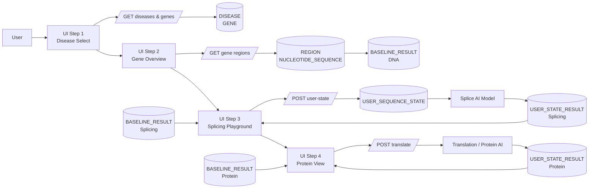

```mermaid
flowchart LR
    U[User] --> UI1[UI Step 1<br/>Disease Select]
    UI1 --> API1[/GET diseases & genes/]
    API1 --> DB1[(DISEASE<br/>GENE)]

    UI1 --> UI2[UI Step 2<br/>Gene Overview]
    UI2 --> API2[/GET gene regions/]
    API2 --> DB2[(REGION<br/>NUCLEOTIDE_SEQUENCE)]

    DB2 --> B1[(BASELINE_RESULT<br/>DNA)]

    UI2 --> UI3[UI Step 3<br/>Splicing Playground]
    UI3 --> API3[/POST user-state/]
    API3 --> DB3[(USER_SEQUENCE_STATE)]

    DB3 --> AI1[Splice AI Model]
    AI1 --> DB4[(USER_STATE_RESULT<br/>Splicing)]

    B2[(BASELINE_RESULT<br/>Splicing)] --> UI3
    DB4 --> UI3

    UI3 --> UI4[UI Step 4<br/>Protein View]
    UI4 --> API4[/POST translate/]
    API4 --> AI2[Translation / Protein AI]
    AI2 --> DB5[(USER_STATE_RESULT<br/>Protein)]

    B3[(BASELINE_RESULT<br/>Protein)] --> UI4
    DB5 --> UI4
```